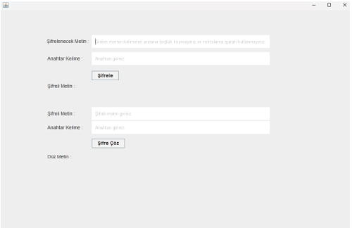
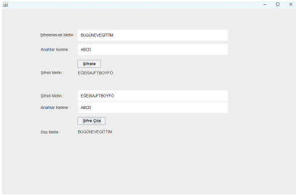
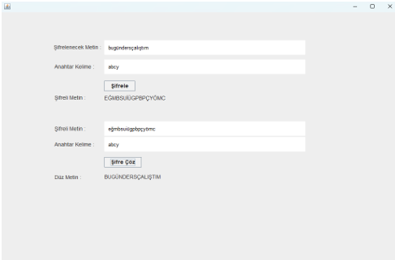

# 🔐 KryptoSystem1 – Türkçe Alfabe Tabanlı Şifreleme Algoritması (Java + JFrame)

Bu proje, Türkçe alfabeyi temel alan özel bir şifreleme algoritmasını kullanıcı dostu bir arayüzle sunar. Java Swing (JFrame) kullanılarak geliştirilen bu uygulama, metinleri güvenli şekilde şifreleyip çözebilir.

---

## 🖼️ Arayüz Özellikleri

- JFrame tabanlı GUI: Kullanıcıdan metin ve anahtar alır, şifreleme/çözme işlemini butonlarla başlatır.
- Girdi kısıtlamaları: Boşluk ve noktalama işaretleri desteklenmez.
- Geribildirim alanları: Şifreli/düz metin sonuçları ayrı alanlarda gösterilir.
- Hata kontrolü: Anahtar uzunluğu otomatik ayarlanır (tekrar/kısaltma).

---

## 🧠 Algoritma Mantığı

### Şifreleme:
- Her karakterin alfabedeki sayısal karşılığı alınır.
- Anahtarın i. ve (i+1). karakterleriyle matematiksel işlem yapılır.
- Mod 29 alınarak yeni karakter belirlenir.
- Mod sonucu 0 ise Sezar benzeri 5 karakter ileri kaydırma uygulanır.

### Şifre Çözme:
- Anahtar karakterlerinin toplamının modüler tersi alınır.
- Şifreli karakterle çarpılarak düz metin karakteri bulunur.
- Mod sonucu 0 ise 5 karakter geri kaydırma uygulanır.
- Modüler ters için Genişletilmiş Öklid Algoritması kullanılır.

---

## 🧪 Örnek Kullanım

| Girdi Metni        | Anahtar | Şifreli Metin         | Çözülmüş Metin        |
|--------------------|---------|------------------------|------------------------|
| BUGÜNEVEGİTTİM     | ABCD    | EĞEISAJFTBOYFÖ         | BUGÜNEVEGİTTİM         |
| BUGÜNDERSÇALIŞTIM  | ABCY    | EĞMBSUİÜGPBPÇYÖMC      | BUGÜNDERSÇALIŞTIM      |

---

## 📸 Ekran Görüntüleri

### Uygulama Arayüzü


### Şifreleme Örneği


### Şifre Çözme Örneği


---

## 🗂️ Proje Yapısı

```
/src
  └── Form1.form           # NetBeans GUI tasarım dosyası
  └── Form1.java           # JFrame arayüz kodu
  └── KryptoSystem1.java   # Şifreleme ve çözme algoritması
  └── MyTextField1.java    # Özel metin alanı bileşeni
/screenshots
  └── arayuz.png
  └── sifreleme.png
  └── cozme.png
## 🚀 Çalıştırma

```bash
javac src/Form1.java
java src.Form1
```

> Not: Java 8+ sürümü önerilir. GUI doğrudan çalışır, terminal girişi gerekmez.

---

## 📄 Lisans

MIT Lisansı – Dilediğiniz gibi kullanabilir, geliştirebilir ve paylaşabilirsiniz.

